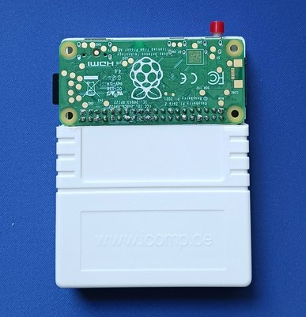
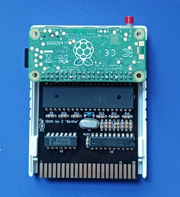
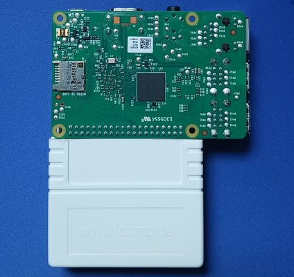
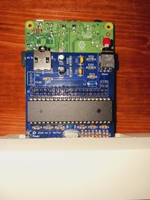

## Idun for the Commodore 128

This is the home of the idun-cartridge for the C128. Here you will find the latest software, along with source code, sample applications, and other content.

What does it do? Hopefully a [demo](https://www.youtube.com/watch?v=X_DMMz55Tpo) is worth a thousand words.

### Hardware

The idun-cartridge uses a Propeller 1 micro-controller to provide a fast hardware interface between the C128 and a Raspberry Pi ("RPi") that runs a customized Linux OS. The cartridge is designed to work and fit best with the Raspberry Pi Zero 2. However, any recent Raspberry Pi can be made to work.

The first set of photos show the idun-cartridge with RPi Zero 2 fitted. As you can see, a standard-sized C64/128 cartridge case can be hacked to cover the board, but leave the RPi, ports, and button accessible.

 A Model B RPi will also fit on an idun-cartridge, as this photo shows. For both Model Zero and Model B, the RPi is fitted on top of the idun-cartridge and upside-down. For the Model B, a case or other support is essential because of the weight.

You can also fit a Model A RPi, but the headers must be relocated to the opposite side of both the idun-cartridge PCB and the RPi itself. In this case, the RPi will be on the bottom (under the idun-cartridge), as shown here connected to a flat C128.

### Support the project

The best way to support the project is to [buy a hardware kit](https://www.tindie.com/products/idun-cartridge-c128/idun-cartridge-c128-kit/) from the online store. The kit comes with everything needed to assemble the idun-cartridge, except for the Raspberry Pi, which you will need to obtain yourself. Only basic soldering skills are needed, since the PCB is strictly through-hole components.

### Quick start

You can download the customized Arch Linux OS image and flash it to a microSD card.

1. Ensure you have a suitable SD card compatible with your Raspberry Pi and at least 4GB (recommend 16 GB).
2. [Download Image](https://drive.google.com/file/d/1tYmL1zDgZj2KxWQS5eT54sy9L9NNPKM7/view?usp=sharing)
3. Use [Raspberry Pi Imager](https://www.raspberrypi.com/software/) or a similar program to write image to SD card.

Your microSD is now ready to use with your idun-cartridge. To expand the file system or setup networking, follow the additional instructions in [setup-rpi.md](doc/setup-rpi.md).

You can also run [idun-vice](https://github.com/idun-project/idun-vice) to experiment with the idun-cartridge software WITHOUT any actual cartridge; just running everything off of the Raspberry Pi.

### Configuration

Configuration options are available in `$HOME/.config/idunrc.toml`. There is documentation within that file, but the following hints are also helpful.

1. Because of the "special" VDC hi-res graphic modes used by some of the software (e.g. `showvdc`), it is very important to set the correct amount of VRAM in the configuration file to either 16kB or 64kB, as appropriate. The setting is the second parameter in the `[vdc]` section.
2. Some monitors are picky about how many rows of text they can display in 80 column mode, and how they look when displaying text in interlaced mode. The default is 27 rows, non-interlaced. You can modify this by changing the first parameter in the `[vdc]` section, and for interlaced text, the section `[vdc_interlace]`. Also take a look at the `mode` command for changing the number of text rows on demand.
3. If you are using the software with only a Raspberry Pi and Vice (no idun-cartridge hardware), then pay careful attention to disable the configuration file from trying to connect with hardware that isn't there. For details, see the [README for idun-vice](https://github.com/idun-project/idun-vice).

### Building C128 code

The idun-cartridge software in this repository is self-hosting. All of the assembly code is built with the `acme` cross-assembler and everything you need to build and modify it can be done on the cartridge itself. You can perform each of these steps from the Linux prompt:

1. Install git: `sudo pacman -S git`
2. Clone this repository to your idun home directory: `git clone https://github.com/idun-project/idun-cartridge`
3. `cd idun-cartridge && ./build.sh`

This will update the `sys` directory with newly built software. See the [Makefile](cbm/Makefile) for details.

### Programming applications

If you intend to modify or add your own command-line tools, start by cloning and building this repository as described above. Then, your best resource is the code in the [cmd](cbm/cmd/) sub-directory, along with the documentation files [apiref.md](doc/apiref.md) and [toolbox.md](doc/toolbox.md). This covers most everything used by the included commands, notwithstanding the new API's that are still under construction.

If you are interested in the Lua integration, then begin by reading [luaref.md](doc/luaref.md). Again, there is sample source code in [samples](samples/) and the [Makefile](samples/Makefile) can serve as a template for adding your own applications. _NOTE: There is a forthcoming Lua tool called `idunc` that will generate a new application template and built it automatically._

### Trivia

[Idun](https://en.wikipedia.org/wiki/I%C3%B0unn) is the [Norse goddess](https://youtu.be/0IIcDB3noxE?t=308) of youth and [rejuvenation](https://youtu.be/GiXNEf_NOak).
